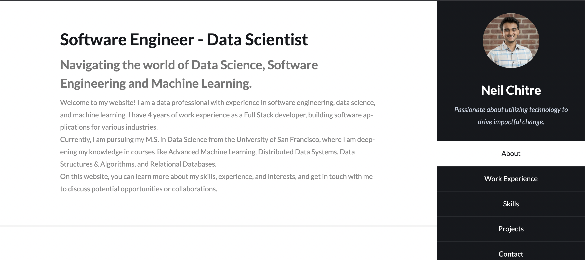

# Neil Chitre's Portfolio Website

This repository contains the source code for my personal portfolio website, showcasing my skills and experience in data engineering, data science, and machine learning.

## Features

- Responsive design for desktop and mobile devices
- Overview of my educational background and work experience
- Detailed presentation of my skills and capabilities
- Downloadable resume

## Technologies Used

- HTML5
- CSS3
- JavaScript
- [Bootstrap](https://getbootstrap.com/)
- [jQuery](https://jquery.com/)

## Getting Started

To run the website locally, follow these steps:

1. Clone this repository to your local machine

2. Navigate to the cloned repository and open the `index.html` file in your favorite web browser.

3. Explore the website!

## Contributing

If you have any suggestions or feedback, feel free to open an issue or submit a pull request. All contributions are welcome!

## License

This project is licensed under the MIT License - see the [LICENSE](https://opensource.org/license/mit/) file for details.
